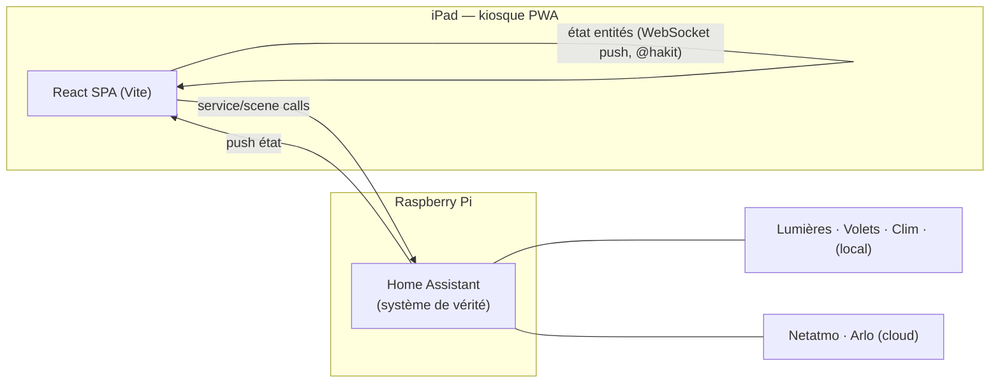
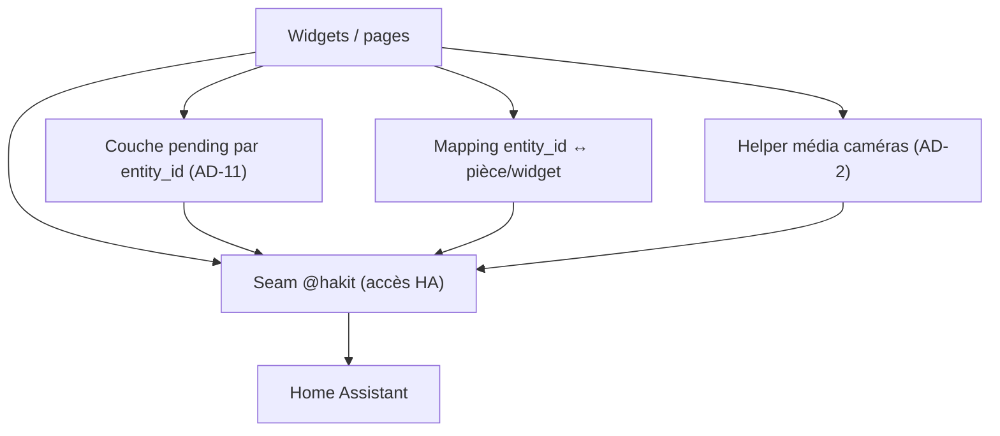

# Architecture Spine — Home Dashboard v1

## Design Paradigm

**Reactive thin-client over a single system-of-record.**

Home Assistant (sur Raspberry Pi) est **l'unique système de vérité** : capteurs, appareils, scènes, historique. Le dashboard est un **SPA React sans backend propre** : l'état des entités circule **HA → UI** par push WebSocket (`@hakit`) ; l'intention utilisateur circule **UI → HA** par appels de services/scènes. Aucun serveur applicatif, aucune base de données propre en v1.



## Invariants & Rules

Direction de dépendance autorisée (qui peut dépendre de qui) :



### AD-1 — Home Assistant est l'unique source de vérité `[ADOPTED]`
- **Binds:** toute donnée partagée / persistée (FR1–FR9)
- **Prevents:** des états divergents, un backend fantôme
- **Rule:** tout état partagé ou persistant vit dans HA ; l'app ne possède que de l'état **UI éphémère** (route active, dialogues). Aucun backend ni base propre en v1.

### AD-2 — Connectivité HA exclusivement via `@hakit` `[ADOPTED]`
- **Binds:** toute I/O vers HA
- **Prevents:** des unités qui ré-implémentent auth/connexion/polling différemment
- **Rule:** les composants accèdent à HA **uniquement** via le provider/hooks `@hakit` ; aucun appel REST/WebSocket ad-hoc vers HA ailleurs. **Exception unique :** le média caméra (live/historique — `camera_proxy`/HLS/WebRTC, FR8) passe par **un seul helper média défini**, seul point sanctionné hors `@hakit`.

### AD-3 — Autorité d'état : une seule source réactive
- **Binds:** l'état des entités HA dans l'UI
- **Prevents:** deux widgets affichant des valeurs obsolètes divergentes
- **Rule:** l'état **confirmé** des entités est consommé **uniquement** via l'abonnement temps réel `@hakit` ; **aucun cache persistant** qui duplique l'état d'entité HA. _Carve-out :_ la couche « pending » bornée d'AD-11 (intentions en vol) est autorisée et **distincte** d'un cache.

### AD-4 — Zéro logique d'automatisation côté client (v1)
- **Binds:** où vit le comportement (FR5 scènes, FR6 clim, automatisations)
- **Prevents:** de la logique métier qui fuit dans le client
- **Rule:** l'app **appelle** des services/scènes HA ; toute logique si/alors, horaire ou scène vit dans HA. _(v2 : l'UI d'édition de règles **écrit** des règles dans HA, elle ne les exécute pas.)_

### AD-5 — Actions de pilotage : UI optimiste + réconciliation
- **Binds:** chaque widget de contrôle (FR2–FR7)
- **Prevents:** un comportement incohérent (laggy vs optimiste) d'un widget à l'autre ; une réconciliation binaire qui casse les domaines transitionnels
- **Rule:** un appui applique un **retour visuel immédiat (<200 ms, NFR1)** via la couche pending (AD-11), puis **converge vers la cible** sur l'écho HA. Les **états transitionnels ne sont pas des échecs** (volet `opening`/`closing` + position ; clim `target` ≠ `current`) : modèle **par domaine** avec timeout ; l'échec = timeout dépassé sans convergence → retour à l'état confirmé + signalement.

### AD-6 — Dégradation à la déconnexion
- **Binds:** tous les widgets (NFR4)
- **Prevents:** que chaque widget gère la coupure différemment / écran blanc ; qu'une entité cloud tombée passe inaperçue socket ouvert
- **Rule:** l'obsolescence est **par entité et indépendante du socket** : perte WebSocket **ou** entité `unavailable`/`unknown` (ex. Netatmo/Arlo cloud qui tombe socket ouvert) → rendre la **dernière valeur connue + indicateur d'obsolescence** ; jamais de blanc.

### AD-7 — Mapping `entity_id` ↔ pièce/widget : source unique
- **Binds:** organisation par pièce (Salon, Chambre Parents, Nathan, Gaspard) et widgets (FR1–FR9)
- **Prevents:** des composants qui codent en dur des `entity_id` de façon incohérente ; **un même concept réel éclaté en deux entités contradictoires**
- **Rule:** une **config unique** mappe les `entity_id` HA aux pièces et widgets ; les `entity_id` sont **le contrat d'intégration**, référencés à un seul endroit. **Une entité HA canonique par concept réel** (ex. « alarme armée » = une seule entité, pas deux) ; le mapping déclare **domaine + service**.

### AD-8 — Auth par jeton longue durée sur l'appareil `[ADOPTED]`
- **Binds:** authentification du client (NFR3)
- **Prevents:** une ré-authentification interactive (kiosque toujours allumé) ; **un token en clair dans le bundle statique**
- **Rule:** auth par **long-lived access token** HA unique, en **config locale gitignorée injectée au runtime — jamais bundlée** dans le build statique lisible. **Préféré :** servi en même origine depuis HA (add-on / ingress), s'appuyer sur la **session/ingress HA** plutôt qu'un token bundlé (exposition moindre). Pas de login interactif.

### AD-9 — Build statique, servi en même origine que HA `[ADOPTED]`
- **Binds:** topologie de déploiement, NFR5 (LAN-first), NFR1 (démarrage à chaud)
- **Prevents:** un tiers serveur applicatif non planifié, des dérives CORS/auth, un démarrage à froid lent
- **Rule:** build **statique** (Vite), servi **depuis HA** (add-on / ingress, ou dossier `www`) → même origine, tout en LAN, aucun serveur applicatif. **PWA :** le service worker met en cache l'**app-shell** (démarrage à chaud quasi-instantané, NFR1) ; les **données d'entités restent toujours live** depuis HA (jamais servies par le cache).

### AD-10 — Modèle d'écran : accueil composé + pages profondes
- **Binds:** navigation (FR8, FR9)
- **Prevents:** une navigation profonde qui casse le principe glanceable
- **Rule:** **un** écran d'accueil composé (widgets pièce/feature + contrôles primaires) + **routes séparées** pour les pages d'approfondissement : **Caméras** (live + historique) et **Détail de pièce** (tous les appareils + historique capteurs d'une pièce, ouvert depuis la carte de pièce). Navigation peu profonde (accueil + un niveau).

### AD-11 — Couche « pending » unique, par entité
- **Binds:** toute action de pilotage (AD-5) et toute mutation de scène (FR5)
- **Prevents:** deux widgets pilotant la même entité (ex. « Tout éteindre » vs widget Salon sur `light.salon`) qui font la course avec des overlays optimistes concurrents ; une entité mutée par scène sans propriétaire optimiste
- **Rule:** les intentions en vol vivent dans **une seule couche pending, clé = `entity_id`**, **last-command-wins**, **bornée/expirante**. Elle est **distincte** d'un cache d'état confirmé (interdit par AD-3) : elle ne stocke que l'intention en attente d'écho HA.

## Consistency Conventions

| Concern | Convention |
| --- | --- |
| Nommage | Les `entity_id` HA sont le contrat ; pièces canoniques : `salon`, `chambre_parents`, `nathan`, `gaspard`. Mapping centralisé (AD-7). |
| Données & formats | État d'entité = forme HA (state + attributes), non recopiée ; horodatages ISO 8601 ; « dernier fait » via helpers HA (v2). |
| État & transverse | Mutation via services/scènes HA uniquement (AD-4) ; état UI local = éphémère (AD-1/AD-3) ; intention en vol = couche pending (AD-11) ; auth = jeton local gitignoré / session HA (AD-8) ; déconnexion = AD-6. |
| Styling | **Tailwind / TailAdmin = primaire.** `@hakit/components` utilise Emotion (CSS-in-JS) : l'isoler / le thématiser, ne pas mélanger les deux systèmes ; privilégier les hooks `@hakit/core` + composants Tailwind maison. |
| Affordance / enfants (NFR2) | Cibles tactiles larges, densité d'information faible, navigation peu profonde. L'archi le **nomme** ; la définition détaillée appartient à la **spec UX** (`bmad-ux`). |

## Stack

_SEED — vérifié courant à la rédaction ; le code en devient propriétaire une fois écrit._

| Name | Version |
| --- | --- |
| React | **19.x — contrainte liée** (peerDep requis de `@hakit` 6.x, pas un simple seed) |
| Vite | courant (seed) |
| TypeScript | courant (seed) |
| @hakit/core | 6.0.2 |
| @hakit/components | 6.0.2 (Emotion en interne — cf. Conventions) |
| Tailwind CSS (base UI : TailAdmin, variante React/Vite) | courant (seed) |
| Home Assistant (Raspberry Pi) | courant (hub / système de vérité) |
| Cible | iPad / iPadOS — PWA plein écran + Guided Access |

_Repli si `@hakit` (mainteneur unique) stagne : `home-assistant-js-websocket` derrière le même seam `src/hakit/` (AD-2)._

## Structural Seed

```text
home-dashboard/
  src/
    hakit/        # seam @hakit : provider + connexion HA ; token = config runtime gitignorée (AD-2, AD-8)
    entities/     # mapping unique entity_id ↔ pièce/widget, domaine+service (AD-7)
    state/        # couche pending par entity_id, last-command-wins (AD-11)
    media/        # helper média caméras — seule exception à AD-2 (FR8)
    widgets/      # widgets par feature (capteurs, lumières, volets, clim, caméras)
    pages/        # accueil (composé) + pages profondes (caméras) — AD-10
    ui/           # primitives UI (TailAdmin/Tailwind), affichage obsolescence (AD-6)
  public/         # manifest PWA, service worker (app-shell, AD-9), icônes
```

## Capability → Architecture Map

| Capability | Lives in | Governed by |
| --- | --- | --- |
| FR1 Capteurs Netatmo (4 pièces) | `widgets/` (capteurs) | AD-3, AD-6, AD-7 |
| FR2–FR3 Éclairage | `widgets/` (lumières) | AD-4, AD-5, AD-7, AD-11 |
| FR4 Volets | `widgets/` (volets) | AD-4, AD-5, AD-7, AD-11 |
| FR5 Scènes mixtes | appel scène HA | AD-4, AD-11 |
| FR6 Climatisation | `widgets/` (clim) | AD-4, AD-5, AD-7, AD-11 |
| FR7 Armer/désarmer | widget accueil | AD-5, AD-7, AD-11 |
| FR8 Caméras (live + historique) `[À RISQUE]` | `pages/` (caméras) | AD-2 (média), AD-10, AD-6 |
| FR9 Écran d'accueil kiosque | `pages/` (accueil) | AD-10, NFR1/NFR2 |
| FR10 Robot aspirateur (Roborock, HA `vacuum`) | `widgets/` (aspirateur) | AD-2, AD-5, AD-7, AD-11 |

## Deferred

- **Couche coordination familiale (v2)** — persistée **d'abord dans les primitives HA natives** (entités *To-do* + helpers `input_boolean`/`input_datetime`) ; le dashboard la reflète via WebSocket. Pas de backend maison.
- **Recettes / meal-planning = app dédiée séparée** — **pas** dans le dashboard/HA : un **contexte borné distinct** (son propre backend/BDD, sa propre source de vérité pour les données recettes). Le dashboard n'en montre qu'une **vue simplifiée en lecture seule**. _Principe :_ cette vue reste **read-only et isolée** de la couche d'état HA (`@hakit`), jamais fusionnée — le dashboard compose des vues bornées. AD-1 (« HA = seul backend ») reste vrai pour la v1 domotique.
  - _Open question (à trancher quand l'app existe) :_ chemin d'intégration de la vue — **poussée dans HA** (préserve AD-1/AD-2) **vs** 2ᵉ source read-only consommée directement.
- **UI d'édition des règles d'automatisation (v2)** — écrit dans HA (AD-4).
- **Voix (v2)** — Google Home → HA → état partagé ; l'app reflète, elle n'implémente pas la voix.
- **Faisabilité flux live Arlo via HA (FR8 `[À RISQUE]`)** — **mis de côté pour l'instant** (décision utilisateur) ; FR8 reste `[À RISQUE]` avec repli snapshots, à revisiter plus tard.
- **Tests / observabilité** — minimal pour un kiosque perso ; à revisiter si la fiabilité devient douloureuse.
- **Durcissement sécurité** — jeton = secret local gitignoré sur LAN mono-foyer (AD-8) ; portée/rotation/TLS différés sauf changement d'exposition.
- **CORS de dev** — le serveur Vite de dev (`localhost:5173`) nécessite `http.cors_allowed_origins` côté HA ; la prod même-origine (AD-9) l'évite. Détail de setup, non structurant.
