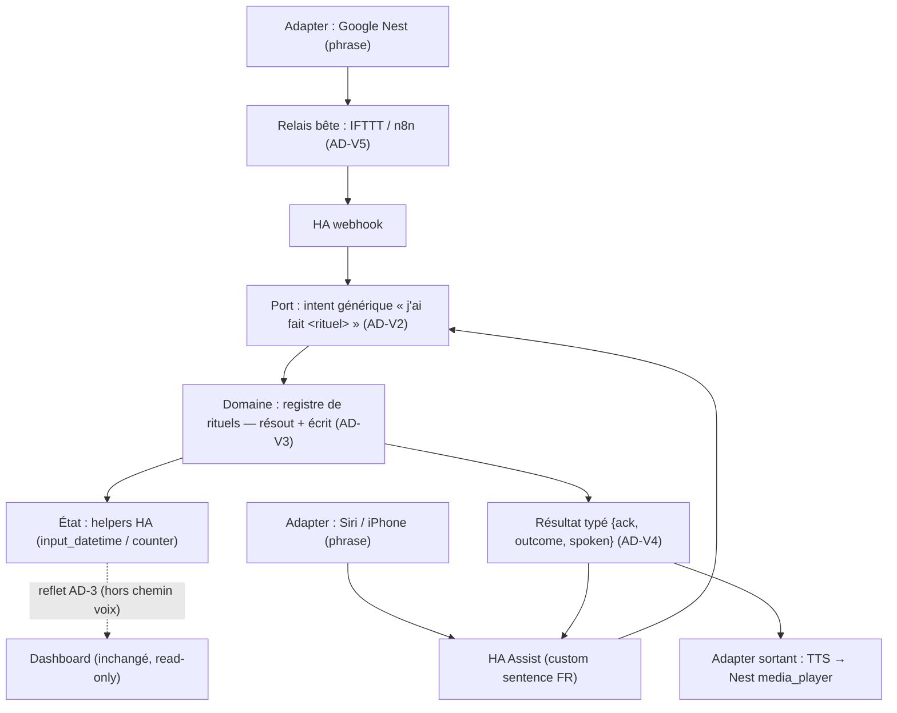

# Architecture Spine — Voix → rituels HA

Un canal **voix** qui marque un rituel « fait » (poubelles / plantes / tortues) en écrivant **les mêmes helpers HA** que les tuiles du dashboard. HA-natif de bout en bout : le dashboard **reflète** (AD-3), **zéro ligne d'app**. Google Nest et Siri convergent sur **un seul intent HA générique**.

## Design Paradigm

**Ports & Adapters (hexagonal), cœur = Home Assistant.**

- **Adapters entrants (voix)** : Google Nest et Siri — interchangeables, sans logique.
- **Port entrant unique** : un **intent HA générique** `« j'ai fait <rituel> »`.
- **Domaine** : un **registre de rituels** (résolution de cible + sémantique + messages) — la seule logique.
- **État** : les **helpers HA** (`input_datetime.*`, `counter.*`), déjà le contrat des tuiles.
- **Adapter sortant (feedback)** : le résultat typé, rendu par un transport propre à chaque provider.
- **Le dashboard est un adapter de lecture indépendant** : il observe les helpers (AD-3), il n'est pas sur le chemin voix.

## Inherited Invariants

Hérités de la spine dashboard — **lecture seule, non re-décidés**. Une décision locale qui les contredit est un conflit à remonter, pas un override.

| Inherited | From parent | Binds here |
| --- | --- | --- |
| AD-1 — HA = unique source de vérité | spine 2026-07-12 | Aucun backend voix propre ; l'état vit dans les helpers HA. |
| AD-3 — Reflet, aucun cache persistant | spine 2026-07-12 | Le dashboard reflète l'écriture voix gratuitement ; rien à écrire côté app. |
| AD-4 — Zéro logique d'automatisation côté client ; planning dans HA | spine 2026-07-12 | La désambiguïsation « quelle poubelle » et toute logique horaire vivent dans HA. |
| AD-7 — Mapping `entity_id` centralisé | spine 2026-07-12 | Les helpers ciblés (`input_datetime.poubelle_*`, `counter.plantes_arrosees`, `counter.tortues_nourries`) sont ceux déjà mappés. |
| AD-15 — Rituel partagé (transport pluggable) | v2 delta | La voix est un nouveau « faire avancer » sur le **même** état rituel ; même sémantique que le tap kiosque. |

## Invariants & Rules

### AD-V1 — La voix écrit dans HA, jamais dans l'app `[ADOPTED]`

- **Binds:** tous les rituels vocaux.
- **Prevents:** couplage app↔voix ; divergence d'état ; duplication du dashboard.
- **Rule:** une commande voix mute un **helper HA** via un intent/script HA ; le dashboard **ne fait que refléter** (AD-3). Aucun composant, route ou état d'app n'est ajouté pour la voix.

### AD-V2 — Un intent générique + un registre de rituels (seam provider-agnostic)

- **Binds:** tous les providers × tous les rituels.
- **Prevents:** duplication de logique par provider ou par rituel ; dérive entre ce qu'écrit la voix et ce qu'écrit la tuile.
- **Rule:** Google **et** Siri déclenchent **le même** intent HA `« j'ai fait <rituel> »` (slot `rituel`). Chaque rituel est **une entrée de registre** `{ résoudre-cible, action-d'écriture, messages }`. **Ajouter un rituel = 1 entrée + 1 phrase**, sans nouveau script.
- **Contrat de clés (anti-divergence) :** le **vocabulaire des clés de rituel** (slug) est **LE contrat partagé** — les phrases FR (Siri) **et** le payload webhook (Google) émettent la **clé exacte** du registre. Une clé inconnue → `outcome: failure` **explicite** (message « rituel non reconnu »), jamais un échec silencieux.

### AD-V3 — Résolution & logique dans HA (instancie AD-4)

- **Binds:** désambiguïsation de cible + sémantique d'écriture.
- **Prevents:** split-brain de logique ; fuite du planning tarifaire/horaire vers le relais ou l'assistant.
- **Rule:** « les poubelles » → le registre résout **la poubelle due** depuis `sensor.poubelle_a_sortir` (logique existante) ; l'écriture est **le même helper que la tuile** (`input_datetime.set_datetime(now)` / `counter` clampé). La couche voix ne connaît **aucun** planning.

### AD-V4 — Feedback calculé une fois dans HA, transport par provider

- **Binds:** le retour vocal (accusé + résultat).
- **Prevents:** messages de résultat divergents ou dupliqués ; logique de feedback dans le relais.
- **Rule:** le registre produit **un** résultat typé `{ ack, outcome: succès | rien-à-faire | échec, spoken }`. Livraison : **Siri** = réponse **Assist inline** (dite par l'appareil) ; **Google** = HA **pousse un TTS** vers l'enceinte **Nest** (`media_player` Cast). Le texte parlé est calculé **une seule fois**, côté HA.

### AD-V5 — Le relais externe est un transport bête

- **Binds:** le chemin Google (IFTTT et/ou n8n).
- **Prevents:** dérive de logique dans IFTTT/n8n (violerait AD-4) ; désambiguïsation hors HA.
- **Rule:** le relais **ne fait que forwarder** la phrase au **webhook HA** — aucune branche, aucune résolution, aucun état. n8n, s'il est présent, est un **hop de transport** optionnel (logging), jamais un décideur.

### Direction de dépendance (qui peut dépendre de qui)



Les flèches ne remontent jamais : les adapters dépendent du port, le port du domaine, le domaine de l'état. Le dashboard ne dépend que des helpers.

## Consistency Conventions

| Concern | Convention |
| --- | --- |
| Nommage | Intent : un intent générique nommé (ex. `RituelFait`) ; clé de rituel en slug (`poubelles`, `plantes`, `tortues`). Phrases FR dans `custom_sentences/fr/`. Scripts/registre préfixés `rituel_`. |
| Données (résultat) | Forme unique `{ ack: bool, outcome: "success" | "noop" | "failure", spoken: str }`. `noop` (« rien à sortir maintenant ») **n'est pas** un échec — message distinct. |
| État & transverse | Mutation **uniquement** via les helpers HA existants (AD-1/AD-3/AD-7) ; aucune persistance voix. Toute logique dans l'`intent_script`/registre HA (AD-4). Le relais et l'assistant ne portent **jamais** d'état. |

## Structural Seed

Tout vit dans la **config HA** (hors-repo, classe « Task 0 ») ; **aucun fichier du dépôt dashboard ne change**.

```text
Home Assistant (config)
  custom_sentences/fr/
    rituels.yaml        # phrases FR → intent RituelFait(rituel)   (Siri/Assist)
  intent_script:        # RituelFait : dispatch vers le registre, renvoie {spoken}
  script/
    rituel_fait         # cœur : résout la cible, écrit le helper, calcule outcome+spoken
    (registre)          # table par rituel : {résoudre, action, messages}
  automation/config:
    webhook « rituel »  # entrée Google : IFTTT/n8n → intent RituelFait
  # feedback Google : script → tts.speak vers media_player.<nest>

Relais externe (hors HA) — catcher de la phrase Google, au choix :
  IFTTT applet « Say a phrase (Google) » → Webhook HA   (n8n optionnel en coupure)
  — ou — Routine Google Home (phrase perso) → Webhook HA
```

Le **contrat d'écriture par rituel** est déjà documenté (`docs/home-assistant.md` : poubelles 6.1, tortues 6.3, plantes 7.1) — le registre réutilise ces mêmes helpers, il n'en invente pas.

## Capability → Architecture Map

| Rituel (phrase) | Résolution (AD-V3) | Écrit | Gouverné par |
| --- | --- | --- | --- |
| « j'ai sorti les poubelles » | poubelle due via `sensor.poubelle_a_sortir` | `input_datetime.poubelle_<due>_sortie = now` | AD-V1/2/3/4 |
| « j'ai arrosé les plantes » | trivial (compteur unique) | `counter.plantes_arrosees` (clamp 1) | AD-V1/2/4 |
| « j'ai nourri les tortues » | trivial (compteur) | `counter.tortues_nourries` (increment) | AD-V1/2/4 |
| _(futur rituel)_ | 1 entrée de registre | son helper | AD-V2 |

## Deferred

- **Câblage exact du catcher Google** (IFTTT « Say a phrase » vs Routine Google Home, direct vs via n8n) : seed de setup, swappable sous AD-V5 ; choix au build (n8n si logging voulu). **⚠️ Confirmer au build que le trigger IFTTT Google Assistant existe encore** (tiers volatil) ; sinon la Routine Google Home est le repli. Alternative **Nabu Casa** (exposer le script à Google) écartée faute de compte confirmé — réévaluable.
- **Qualité STT / reconnaissance FR** (accents, « poubelles » mal compris) : dépend de l'assistant ; hors périmètre archi. Piste : Speech-to-Phrase local côté HA.
- **Taxonomie d'échec fine** au-delà de `success|noop|failure` (ex. helper injoignable) : à étendre dans le registre si besoin.
- **Enceinte cible du feedback Google** (quelle Nest parle) : réglage de setup.
- **Commandes voix non-rituel** (piloter lumières, etc.) : hors scope — cette spine ne couvre que « marquer un rituel fait ».
