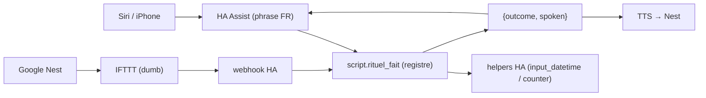

# Configuration Home Assistant requise par le dashboard

Le dashboard est un **client mince** : Home Assistant est l'unique source de vérité
(AD-1) et **toute logique horaire / d'automatisation vit dans HA** (AD-4). Certaines
features ont donc besoin d'**entités HA** (helpers, capteurs template) créées côté HA.
Ce document liste ce setup, feature par feature.

> Après édition de `configuration.yaml` : **Outils de développement → YAML → Recharger**
> le domaine concerné (Template entities, Input datetime…), ou redémarrer HA. Les
> helpers créés via l'UI (Paramètres → Appareils et services → Helpers) ne nécessitent
> pas de rechargement.

---

## Poubelles — sortie jaune / noire (Story 6.1)

La tuile poubelle **reflète** un capteur template et **écrit un timestamp** au marquage
« sortie ». Le _schéma horaire, l'état « fait/oubli » et l'historique_ vivent **dans HA**.

### Créneaux

- **Jaune** (tri) : mardi **18h** → mercredi **7h**
- **Noire** (ordures) : jeudi **18h** → vendredi **7h**

### 1. Quatre helpers `input_datetime` (timestamps de sortie + d'acquittement)

Le plus simple via l'UI : **Paramètres → Appareils et services → Helpers → Créer un
helper → Date et/ou heure** → cocher **date ET heure**. Créer :

- **Poubelle jaune sortie** → `input_datetime.poubelle_jaune_sortie`
- **Poubelle noire sortie** → `input_datetime.poubelle_noire_sortie`
- **Poubelle jaune oubli ack** → `input_datetime.poubelle_jaune_oubli_ack`
- **Poubelle noire oubli ack** → `input_datetime.poubelle_noire_oubli_ack`

Équivalent YAML :

```yaml
input_datetime:
  poubelle_jaune_sortie:
    { name: Poubelle jaune sortie, has_date: true, has_time: true }
  poubelle_noire_sortie:
    { name: Poubelle noire sortie, has_date: true, has_time: true }
  poubelle_jaune_oubli_ack:
    { name: Poubelle jaune oubli ack, has_date: true, has_time: true }
  poubelle_noire_oubli_ack:
    { name: Poubelle noire oubli ack, has_date: true, has_time: true }
```

L'app écrit `now` (`input_datetime.set_datetime`) dans **`_sortie`** au tap « Sortie »
(poubelle sortie), et dans **`_oubli_ack`** quand on masque un oubli sans la sortir. Les
deux timestamps auto-expirent par comparaison à la fenêtre du cycle (voir template).
**L'historique HA de ces entités = le journal** récupérable (le dashboard n'a aucune
persistance propre).

### 2. Capteur template `sensor.poubelle_a_sortir`

Il calcule l'état à partir des créneaux + des quatre timestamps ci-dessus.

Le capteur suit, **par poubelle**, un cycle de phases `{couleur}_{phase}` :
`a_sortir → sortie` (si sortie à temps) ou `a_sortir → oubli → oubli_ack` (si oubliée
puis masquée). Chaque phase (hors `a_sortir`/`aucune`) est portée par un timestamp qui
auto-expire à la fin de la fenêtre de collecte. La fenêtre de visibilité (`_sortie` et
`_oubli*`) est bornée à **midi le jour de collecte** (mercredi pour jaune, vendredi pour
noire) — seuil ajustable.

```yaml
template:
  - sensor:
      - name: "Poubelle à sortir"
        unique_id: poubelle_a_sortir
        state: >
          
          
             {# jaune: début créneau #}
             {# jaune: fin créneau  #}
             {# jaune: fin visibilité #}
             {# noire: début créneau #}
             {# noire: fin créneau  #}
             {# noire: fin visibilité #}
          
          
          
          
            {# sortie faite ce cycle #}
          
               {# oubli acquitté ce cycle #}
          
          
          {# ---- Jaune : fenêtre mardi 18h → mercredi midi ---- #}
          
            
            
            
            
            
          {# ---- Noire : fenêtre jeudi 18h → vendredi midi ---- #}
          
            
            
            
            
            
          
          {{ r.v }}
```

Ré-évalué **chaque minute** (HA le fait pour les templates `now()`) **et** dès qu'un
`input_datetime` référencé change — donc un tap se reflète en < 1 s, les bascules horaires
en < 1 min.

### Contrat d'interface (⚠️ le code du dashboard en dépend)

`sensor.poubelle_a_sortir` — `state` ∈ (avec `{c}` ∈ `jaune` | `noire`) :

| state           | signification                            | tuile (`src/widgets/BinTile.tsx`)               |
| --------------- | ---------------------------------------- | ----------------------------------------------- |
| `aucune`        | rien à sortir                            | **cachée**                                      |
| `{c}_a_sortir`  | à sortir maintenant (créneau, pas faite) | icône couleur, tap → écrit `_sortie`            |
| `{c}_sortie`    | sortie faite ce cycle                    | icône atténuée + ✓, **désactivée**              |
| `{c}_oubli`     | non sortie, créneau passé                | bordure rouge épaisse, tap → écrit `_oubli_ack` |
| `{c}_oubli_ack` | oubli acquitté (masqué sans sortie)      | **cachée**                                      |

Le tap n'appelle **jamais** de service de logique : il écrit seulement un timestamp
(`_sortie` ou `_oubli_ack`) et **HA recalcule** l'état — le front ne fait que refléter.

Si tu changes ces valeurs d'état côté HA, il faut mettre à jour le mapping
(`src/entities/mapping.ts`) et `binView` (`src/widgets/bin-state.ts`) en conséquence.

### 3. Appliquer & tester

- **Recharger** : Outils de dév → YAML → **Recharger les entités Template** (+ **Recharger
  Input datetime** si helpers en YAML).
- **Tester la logique sans attendre mardi** : Outils de dév → **Template**, coller le bloc
  `state:` et remplacer `` par une date forcée (ex. un mardi 19h →
  `jaune_a_sortir` ; un mercredi 8h sans sortie → `jaune_oubli`) pour voir la valeur.
- **Tester l'écriture** : Outils de dév → Actions → `input_datetime.set_datetime` sur
  `poubelle_jaune_sortie` avec l'heure courante → le capteur passe `jaune_a_sortir →
jaune_sortie` (bouton « Sortie ») ; sur `poubelle_jaune_oubli_ack` → `jaune_oubli →
jaune_oubli_ack` (masquage d'un oubli).

### Réglages possibles

- **Fin de visibilité `_sortie`/`_oubli*`** : bornée à midi le jour de collecte
  (`wed12`/`fri12`). Élargir/réduire en changeant ces seuils.
- **Acquittement d'oubli** : le tap sur `_oubli` écrit `_oubli_ack` (masque sans logger de
  sortie) ; l'ack auto-expire au cycle suivant. Une **sortie tardive** reste possible tant
  qu'on est en `_oubli` (avant acquittement) — pour la rétablir, câbler le tap `_oubli` sur
  `_sortie` plutôt que `_oubli_ack` côté app.

---

## Tortues — nourrissage 2×/jour (Story 6.3)

La tuile tortue **reflète** un compteur HA (0..2 repas donnés aujourd'hui) et
**incrémente** ce compteur au tap. Le _schéma « 2×/jour » et la remise à zéro
quotidienne_ vivent **dans HA** (AD-4). L'app n'a **aucune persistance propre**.

### 1. Un helper `counter`

**Paramètres → Appareils et services → Helpers → Créer un helper → Compteur** :

- **Tortues repas** → `counter.tortues_repas` — **minimum 0**, **maximum 2**, **pas 1**,
  valeur initiale **0**.

Équivalent YAML :

```yaml
counter:
  tortues_repas:
    name: Tortues repas
    minimum: 0
    maximum: 2
    step: 1
    initial: 0
```

Le `maximum: 2` fait qu'un `counter.increment` au-delà de 2 est un **no-op** (HA clampe) —
garde-fou même si le bouton désactivé de l'app échouait.

### 2. Une automation « Reset tortues minuit »

Remet le compteur à 0 chaque nuit (le « schéma horaire » côté HA, AD-4) :

```yaml
automation:
  - alias: Reset tortues minuit
    trigger:
      - platform: time
        at: "00:00:00"
    action:
      - service: counter.reset
        target:
          entity_id: counter.tortues_repas
```

### Contrat d'interface (⚠️ le code du dashboard en dépend)

`counter.tortues_repas` — `state` ∈ :

| state           | tuile (`src/widgets/TurtleTile.tsx`)                     |
| --------------- | -------------------------------------------------------- |
| `"0"`           | fond vide ; tap → `counter.increment`                    |
| `"1"`           | fond à moitié ; tap → `counter.increment`                |
| `"2"`           | fond plein, **désactivée** (repas faits, jusqu'au reset) |
| `unavailable`/… | obsolescence (atténuée, non interactive — AD-6)          |

Le tap n'appelle **que** `counter.increment` (service HA, AD-4) ; **HA recalcule** l'état,
le front ne fait que refléter. Si tu changes l'`entity_id`, mets à jour le mapping
(`src/entities/mapping.ts`, `turtlesConfig()`).

### 3. Appliquer & tester

- **Recharger** : Outils de dév → YAML → **Recharger Compteur** et **Recharger Automation**
  (ou redémarrer HA) ; helpers créés via l'UI : pas de rechargement.
- **Tester** : Outils de dév → Actions → `counter.increment` sur `counter.tortues_repas` →
  l'état passe `0 → 1 → 2` (la tuile se remplit) ; `counter.reset` → retour à `0`.

---

## Arrosage — plantes 1×/jour (Story 7.1)

La tuile plante **reflète** un compteur HA (0 = à arroser, 1 = arrosé aujourd'hui) et
**incrémente** ce compteur au tap. Le _rituel « 1×/jour » et la remise à zéro
quotidienne_ vivent **dans HA** (AD-4). L'app n'a **aucune persistance propre** et
**ne planifie rien** (FR-8). Même moule que les Tortues, avec `maximum: 1`.

### 1. Un helper `counter`

**Paramètres → Appareils et services → Helpers → Créer un helper → Compteur** :

- **Plantes arrosées** → `counter.plantes_arrosees` — **minimum 0**, **maximum 1**, **pas 1**,
  valeur initiale **0**.

Équivalent YAML :

```yaml
counter:
  plantes_arrosees:
    name: Plantes arrosées
    minimum: 0
    maximum: 1
    step: 1
    initial: 0
```

Le `maximum: 1` fait qu'un `counter.increment` au-delà de 1 est un **no-op** (HA clampe) —
garde-fou même si le bouton désactivé de l'app échouait.

> Alternative : un `input_boolean.plantes_arrosees` (`off`/`on`) convient aussi ; le tap
> bascule `on` et le reset repasse `off`. Le `counter` est retenu pour rester homogène
> avec les Tortues. Si tu choisis l'`input_boolean`, adapte le contrat d'interface et le
> mapping en conséquence.

### 2. Une automation « Reset arrosage minuit »

Remet le compteur à 0 chaque nuit (le « schéma horaire » côté HA, AD-4) :

```yaml
automation:
  - alias: Reset arrosage minuit
    trigger:
      - platform: time
        at: "00:00:00"
    action:
      - service: counter.reset
        target:
          entity_id: counter.plantes_arrosees
```

### Contrat d'interface (⚠️ le code du dashboard en dépend)

`counter.plantes_arrosees` — `state` ∈ :

| state           | tuile (`src/widgets/` — clone `TurtleTile`, `maximum: 1`)  |
| --------------- | ---------------------------------------------------------- |
| `"0"`           | fond vide (à arroser) ; tap → `counter.increment`          |
| `"1"`           | fond plein, **désactivée** (arrosé, jusqu'au reset minuit) |
| `unavailable`/… | obsolescence (atténuée, non interactive — AD-6)            |

Le tap n'appelle **que** `counter.increment` (service HA, AD-4) ; **HA recalcule** l'état,
le front ne fait que refléter (reflect-only, pas d'optimiste). Si tu changes l'`entity_id`,
mets à jour le mapping (`src/entities/mapping.ts`).

### 3. Appliquer & tester

- **Recharger** : Outils de dév → YAML → **Recharger Compteur** et **Recharger Automation**
  (ou redémarrer HA) ; helpers créés via l'UI : pas de rechargement.
- **Tester** : Outils de dév → Actions → `counter.increment` sur `counter.plantes_arrosees` →
  l'état passe `0 → 1` (la tuile se remplit, puis se désactive) ; `counter.reset` → retour à `0`.

---

## Électricité — conso & coût (Story 9.1)

La micro-tuile Électricité **reflète** en lecture seule un capteur HA de **conso
journalière** (kWh cumulés du jour) et un **prix** (€/kWh), et en **dérive le coût du
jour** (`conso × prix`) — une **dérivation d'affichage**, jamais un état stocké
(AD-16). L'app ne planifie rien : le **reset minuit** et (Story 9.2) le **schéma
heures creuses/pleines** vivent **dans HA** (AD-4). Purement HA-natif, reflect-only
(même patron que l'Ambiance Netatmo, Story 1.5).

### 1. Un capteur de conso journalière (kWh, reset minuit)

Le dashboard attend un `sensor.*` dont le `state` = **kWh consommés depuis 00:00**
(cumul du jour, remis à 0 chaque nuit par HA). Deux voies :

- **Intégration fournisseur** (Enedis / TotalÉnergies…) exposant déjà un capteur
  _journalier_ → l'utiliser directement.
- Sinon, un **`utility_meter`** en cycle quotidien au-dessus d'un capteur d'énergie
  cumulée :

```yaml
utility_meter:
  electricite_conso_jour:
    source: sensor.<compteur_energie_kwh>
    cycle: daily
```

> ⚠️ **entity_id placeholder** : le mapping du dashboard utilise
> `sensor.electricite_conso_jour` **en attendant** le slug réel (dépend de
> l'intégration). Mets à jour `src/entities/mapping.ts` avec le vrai id.

### 2. Un helper `input_number` pour le prix

**Paramètres → Appareils et services → Helpers → Créer un helper → Nombre** :

- **Prix kWh** → `input_number.prix_kwh` — €/kWh.

```yaml
input_number:
  prix_kwh:
    name: Prix kWh
    min: 0
    max: 1
    step: 0.0001
    unit_of_measurement: "€/kWh"
```

> Un **seul prix flat** pour la Story 9.1. La **Story 9.2** ajoutera un **2ᵉ prix**
> (heures creuses / heures pleines) + un capteur de **période courante** HC/HP.

### Contrat d'interface (⚠️ le code du dashboard en dépend)

| entité                          | rôle          | état attendu                           |
| ------------------------------- | ------------- | -------------------------------------- |
| `sensor.electricite_conso_jour` | conso du jour | nombre en **kWh** (cumul depuis 00:00) |
| `input_number.prix_kwh`         | prix unitaire | nombre en **€/kWh**                    |

Le **coût du jour** = `conso × prix`, calculé **côté app à l'affichage** (jamais
persisté, AD-16). `unavailable`/`unknown`/socket perdue → **obsolescence** (dernière
valeur + « Hors ligne », AD-6). Si tu changes un `entity_id`, mets à jour le mapping
(`src/entities/mapping.ts`).

### 3. Appliquer & tester

- **Recharger** : Outils de dév → YAML → **Recharger Utility Meter** (si utilisé) ;
  helper `input_number` créé via l'UI : pas de rechargement.
- **Tester** : la tuile montre `conso × prix` (ex. 8,2 kWh × 0,18 €/kWh ⇒ 1,48 €) ;
  tap → page `/electricite` (coût + conso + prix + graphe conso + seam HC/HP). Coupe
  le capteur (`unavailable`) → dernière valeur + « Hors ligne », jamais de blanc.

---

## Climatisation — étage (Story 2.6)

**Aucun setup HA custom requis** : contrairement aux poubelles/tortues, la clim est une
**entité native** de l'intégration **Daikin Onecta** (Paramètres → Appareils et services).
Le dashboard la pilote directement, aucun helper / template / automation à créer.

### Contrat d'interface (⚠️ le code du dashboard en dépend)

| Élément                      | Valeur                                                                                                                                                        |
| ---------------------------- | ------------------------------------------------------------------------------------------------------------------------------------------------------------- |
| Entité `climate`             | `climate.climatiseur_etage_room_temperature`                                                                                                                  |
| Capteur ambiant (repli)      | `sensor.climatiseur_etage_climatecontrol_room_temperature`                                                                                                    |
| Services appelés             | `climate.set_hvac_mode`, `climate.set_temperature`, `climate.set_fan_mode`, `climate.set_swing_mode`                                                          |
| Attributs lus                | `temperature` (consigne), `current_temperature`, `hvac_modes`, `fan_mode`/`fan_modes`, `swing_mode`/`swing_modes`, `min_temp`, `max_temp`, `target_temp_step` |
| Capacités (unité de Florian) | modes `heat_cool`(Auto)/`heat`/`cool`/`dry`/`fan_only`/`off` · fan `Auto/Quiet/1-5` · swing `on/off`                                                          |

Les `entity_id` vivent **uniquement** dans `src/entities/mapping.ts` (AD-7).

### ⚠️ Onecta = cloud à quota

L'intégration est **cloud, pollée** (pas push local), avec une **limite d'appels
journalière** (`sensor.climatiseur_etage_gateway_ratelimit_remaining_day`). Le dashboard :

- **debounce** les réglages de consigne (une rafale −/+ = un seul appel) ;
- garde l'affichage optimiste **jusqu'à l'écho** (l'écho tarde — poll cloud), sans
  retour arrière brutal ;
- n'ajoute **aucun** polling maison ; le `button.climatiseur_etage_refresh` reste manuel.

**Hors périmètre 2.6** (candidats à une future page « Détail climatisation ») :
température extérieure, capteurs de défaut/alerte, présets `boost`/`away`
(`climate.set_preset_mode`), planning (`select.*_schedule`).

---

## Voix — marquer un rituel « fait » (Google Nest + Siri)

Dire « **Ok Google / Dis Siri, j'ai sorti les poubelles / arrosé les plantes / nourri les
tortues** » écrit **les mêmes helpers HA** que les tuiles du dashboard. Le dashboard
**reflète** (AD-3) — **aucun changement d'app**. Réf. archi :
`planning-artifacts/architecture/architecture-voix-rituels-2026-07-23/ARCHITECTURE-SPINE.md`
(AD-V1…AD-V5).

**Principe** : Google et Siri convergent sur **un seul script HA `rituel_fait`** (le
« registre » = la seule logique, AD-V2/V3). Il **résout la cible**, **écrit le helper**, et
**renvoie un message parlé** `{ outcome, spoken }`. Le feedback est calculé **une fois** puis
dit par l'iPhone (Siri) ou poussé en TTS vers la Nest (Google) (AD-V4).



### 1. Le script central `rituel_fait` (registre + logique)

> **Un seul endroit qui « fait avancer » (AD-V2/V3).** Ajouter un rituel = **une entrée de
> `registre` + une phrase** (§2). La désambiguïsation « quelle poubelle » vit **ici**, pas dans
> l'assistant ni le relais (AD-4/AD-V5).

```yaml
script:
  rituel_fait:
    alias: "Rituel fait (voix)"
    fields:
      rituel:
        description: "Clé du rituel : poubelles | plantes | tortues"
    sequence:
      - variables:
          # ---- REGISTRE — ajouter un rituel = une clé ici (+ une phrase §2) ----
          registre:
            plantes:
              {
                type: counter,
                entity: counter.plantes_arrosees,
                nom: "les plantes",
              }
            tortues:
              {
                type: counter,
                entity: counter.tortues_nourries,
                nom: "les tortues",
              }
            poubelles: { type: poubelle, nom: "les poubelles" }
          def: "{{ registre.get(rituel) }}"
      - choose:
          # ---- clé inconnue → échec EXPLICITE (contrat de clés, AD-V2) ----
          - conditions: "{{ def is none }}"
            sequence:
              - variables:
                  resultat:
                    {
                      outcome: failure,
                      spoken: "Désolé, je ne connais pas ce rituel.",
                    }
          # ---- compteur (plantes / tortues) : clamp HA → déjà-fait = noop ----
          - conditions: "{{ def.type == 'counter' }}"
            sequence:
              - variables:
                  cur: "{{ states(def.entity) | int(0) }}"
                  mx: "{{ state_attr(def.entity, 'maximum') | int(1) }}"
              - if: "{{ cur >= mx }}"
                then:
                  - variables:
                      resultat:
                        {
                          outcome: noop,
                          spoken: "C'était déjà noté pour {{ def.nom }}.",
                        }
                else:
                  - service: counter.increment
                    target: { entity_id: "{{ def.entity }}" }
                  - variables:
                      resultat:
                        {
                          outcome: success,
                          spoken: "C'est noté, {{ def.nom }} !",
                        }
          # ---- poubelle : résout la poubelle DUE depuis le capteur (AD-V3) ----
          - conditions: "{{ def.type == 'poubelle' }}"
            sequence:
              - variables:
                  s: "{{ states('sensor.poubelle_a_sortir') }}"
                  couleur: "{{ s.split('_')[0] if '_' in s else '' }}"
                  due: "{{ couleur in ['jaune','noire'] and ('a_sortir' in s or s.endswith('oubli')) }}"
              - if: "{{ due }}"
                then:
                  # ⚠️ epoch, pas une heure locale (leçon 6.1 D1)
                  - service: input_datetime.set_datetime
                    target:
                      {
                        entity_id: "input_datetime.poubelle_{{ couleur }}_sortie",
                      }
                    data: { timestamp: "{{ now().timestamp() | int }}" }
                  - variables:
                      resultat:
                        {
                          outcome: success,
                          spoken: "C'est noté, poubelle {{ couleur }} sortie !",
                        }
                else:
                  - variables:
                      resultat:
                        {
                          outcome: noop,
                          spoken: "Aucune poubelle à sortir en ce moment.",
                        }
      - stop: "fait"
        response_variable: resultat
```

> ⚠️ **Syntaxe `stop` + `response_variable`** (script qui renvoie une réponse) : HA **2024.6+**.
> Sur une version antérieure, adapter (voir _Scripts → Responses_ dans la doc HA). Teste dans
> **Outils de dév → Actions** : appelle `script.rituel_fait` avec `rituel: plantes` et vérifie
> la réponse `{ outcome, spoken }`.

### 2. Phrases FR + intent Assist (chemin Siri)

`config/custom_sentences/fr/rituels.yaml` — **la clé du slug est le contrat** (AD-V2) : chaque
groupe de phrases fixe la clé exacte du registre.

```yaml
language: "fr"
intents:
  RituelFait:
    data:
      - sentences: ["j'ai sorti les poubelles", "les poubelles sont sorties"]
        slots: { rituel: "poubelles" }
      - sentences: ["j'ai arrosé les plantes", "j'ai arrosé"]
        slots: { rituel: "plantes" }
      - sentences: ["j'ai nourri les tortues"]
        slots: { rituel: "tortues" }
```

`configuration.yaml` — l'intent appelle le script et **parle** sa réponse :

```yaml
intent_script:
  RituelFait:
    action:
      - service: script.rituel_fait
        data: { rituel: "{{ rituel }}" }
        response_variable: r
    speech:
      text: "{{ r.spoken }}"
```

### 3. Le Raccourci Siri (iPhone)

App **Raccourcis** → un raccourci **par rituel** :

1. Action **« Assist »** (fournie par l'app **Home Assistant Companion**) → texte = la phrase
   (ex. `j'ai arrosé les plantes`).
2. Action **« Énoncer le texte »** → la **réponse** de l'action Assist (Siri dit le résultat).
3. **Nomme le raccourci avec la phrase** (« j'ai arrosé les plantes ») → « **Dis Siri, j'ai
   arrosé les plantes** » le déclenche.

Local / VPN : marche sans cloud (l'app Companion parle à HA directement).

### 4. Chemin Google (Nest) : phrase → webhook → script → TTS retour

> **Prérequis** : HA doit être **joignable depuis internet** pour recevoir le webhook (IFTTT/Google
> sont dans le cloud) — **webhook cloud Nabu Casa** recommandé, ou proxy inverse. (Siri, lui, n'en
> a pas besoin.)

`configuration.yaml` (ou l'éditeur d'automatisations) :

```yaml
automation:
  - alias: "Voix — rituel via webhook (Google)"
    trigger:
      - platform: webhook
        webhook_id: "<SECRET_LONG_ALEATOIRE>" # 🔒 l'URL = un secret, ne pas partager
        allowed_methods: [POST]
        local_only: false # le cloud IFTTT/Google l'appelle
    action:
      - service: script.rituel_fait
        data: { rituel: "{{ trigger.json.rituel }}" }
        response_variable: r
      # feedback dynamique côté Google : HA pousse le TTS vers la Nest (AD-V4)
      - service: tts.speak
        target: { entity_id: tts.google_translate_fr } # ton moteur TTS
        data:
          media_player_entity_id: media_player.<ta_enceinte_nest>
          message: "{{ r.spoken }}"
```

**Applet IFTTT** (une par rituel — le relais est bête, il ne fait que forwarder, AD-V5) :

- **If** : Google Assistant → _Say a simple phrase_ → « j'ai sorti les poubelles ».
- **Then** : Webhooks → _Make a web request_ → `POST` l'URL du webhook HA, `Content-Type:
application/json`, body `{"rituel":"poubelles"}`.

> ⚠️ **Vérifie au build** que le déclencheur IFTTT « Google Assistant » existe toujours (tiers
> volatil) ; sinon **Routine Google Home** (phrase perso) → appeler le webhook/script.
> n8n reste **optionnel** en coupure (IFTTT → n8n → webhook HA) si tu veux du logging — mais
> **aucune logique dedans** (AD-V5).

### 5. Ajouter un rituel plus tard

1. Une entrée dans `registre` (§1) : `{ type: counter|poubelle, entity: …, nom: … }`.
2. Un groupe de phrases dans `rituels.yaml` (§2) avec le **slug exact**.
3. (Google) une applet IFTTT qui poste `{"rituel":"<slug>"}`.

Aucun nouveau script, aucune ligne d'app.

### 6. Appliquer & tester

- **Recharger** : Outils de dév → YAML → **Recharger les scripts / automatisations / intents** ;
  `custom_sentences` : **redémarrage** HA (chargé au boot).
- **Tester le cœur** : Outils de dév → Actions → `script.rituel_fait` (`rituel: poubelles` un jour
  de collecte → `input_datetime.poubelle_*_sortie` écrit + la tuile passe « sortie » ; hors créneau
  → `outcome: noop`).
- **Tester Siri** : « Dis Siri, j'ai arrosé les plantes » → la tuile plante se remplit + Siri
  confirme. **Google** : dis la phrase → la Nest répond + la tuile bouge.
